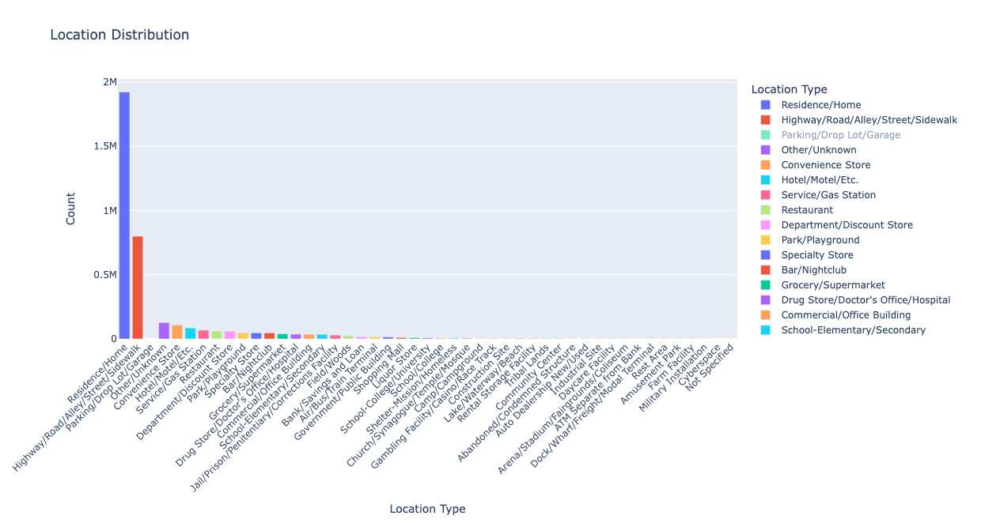

# Gun Violence Analysis

## Introduction

In this analysis, we explore the demographic and situational factors involved in criminal incidents, based on a set of datasets. Through various visualizations, we aim to understand trends in offender and victim characteristics, the nature of offenses, and the types of locations and weapons involved. This report presents insights into offender-victim relationships, age distributions, race, ethnicity, gender, offense types, and other relevant factors to better inform crime prevention strategies.

### Reported Locations of Incidents

This chart shows the frequency of criminal incidents based on their location, shedding light on the environments where these offenses are most likely to occur.

{width="500"}

The majority of incidents occur in residential locations, with a significant number also taking place in public areas such as streets and sidewalks. These findings emphasize the importance of focusing on both private and public safety measures to reduce criminal activities in these common settings.

### Ethnicities of the Offenders vs Victims

These charts compare the ethnicity distributions of offenders and victims, providing insight into potential patterns of racial disparities.

.png){fig-align="left" width="500"} .png){fig-align="right" width="500"}

The ethnicity distribution reveals that the majority of both offenders and victims are categorized as non-Hispanic and non-Latino. These findings suggest that ethnic groups other than Hispanic or Latino individuals are more frequently involved in criminal incidents, either as offenders or victims. Further analysis is required to identify the underlying sociocultural or systemic factors that contribute to these patterns.

## Conclusion

This statistical analysis reveals several critical patterns in criminal activity, highlighting age, race, ethnicity, gender, and the nature of offenses. It is evident that younger individuals, particularly males, are most often involved in criminal incidents, both as offenders and victims. The types of incidents, locations, and weapons used also reflect broader social dynamics, offering valuable insights for policy development, resource allocation, and crime prevention strategies.

By further investigating these trends and integrating additional datasets, law enforcement agencies and policymakers can take more targeted actions to reduce crime rates and enhance public safety.