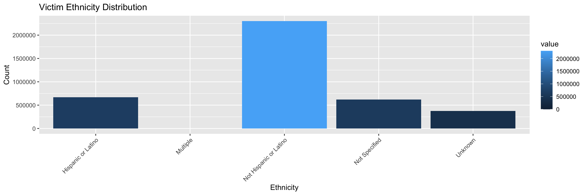

# Introduction

In this analysis, we explore the demographic and situational factors involved in criminal incidents, based on a set of datasets. Through various visualizations, we aim to understand trends in offender and victim characteristics, the nature of offenses, and the types of locations and weapons involved. This report presents insights into offender-victim relationships, age distributions, race, ethnicity, gender, offense types, and other relevant factors to better inform crime prevention strategies.

### Data & Libraries


# Visualizations of the Ages of Offenders and Victims

These visualizations reveal the age distribution of both offenders and victims, helping to identify the most common age groups involved in criminal incidents.


::: {.cell}

```{.r .cell-code}
# Offender Age Distribution
ggplot(data1, aes(x = key, y = value, fill = value)) + 
  geom_bar(stat = "identity") +
  labs(title = "Offender Age Distribution", x = "Offender Age", y = "Count") +
  theme(axis.text.x = element_text(angle = 45, hjust = 1))
```

::: {.cell-output-display}
{width=1152}
:::

```{.r .cell-code}
# Victim Age Distribution
ggplot(data2, aes(x = key, y = value, fill = value)) + 
  geom_bar(stat = "identity") +
  labs(title = "Victim Age Distribution", x = "Victim Age", y = "Count") +
  theme(axis.text.x = element_text(angle = 45, hjust = 1))
```

::: {.cell-output-display}
{width=1152}
:::
:::


The offender age distribution shows that individuals aged 20–29 are most commonly involved in criminal activities, followed closely by those in the 30–39 age group. This suggests that younger adults are more likely to engage in offenses. A similar trend is observed in the victim age distribution, where individuals in their 20s are most frequently victimized. This overlap may reflect social or environmental factors that influence both the likelihood of offending and victimization.

# Visualizations of Ethnicity

These charts compare the ethnicity distributions of offenders and victims, providing insight into potential patterns of racial disparities.


::: {.cell}

```{.r .cell-code}
# Offender Ethnicity Counts
ggplot(data3, aes(x = key, y = value, fill = value)) + 
  geom_bar(stat = "identity") +
  labs(title = "Offender Ethnicity Distribution", x = "Ethnicity", y = "Count") +
  theme(axis.text.x = element_text(angle = 45, hjust = 1))
```

::: {.cell-output-display}
{width=1152}
:::

```{.r .cell-code}
# Victim Ethnicity Counts
ggplot(data4, aes(x = key, y = value, fill = value)) + 
  geom_bar(stat = "identity") +
  labs(title = "Victim Ethnicity Distribution", x = "Ethnicity", y = "Count") +
  theme(axis.text.x = element_text(angle = 45, hjust = 1))
```

::: {.cell-output-display}
{width=1152}
:::
:::


The ethnicity distribution reveals that the majority of both offenders and victims are categorized as non-Hispanic and non-Latino. These findings suggest that ethnic groups other than Hispanic or Latino individuals are more frequently involved in criminal incidents, either as offenders or victims. Further analysis is required to identify the underlying sociocultural or systemic factors that contribute to these patterns.

# Visualizations of Race

Here, we examine the race distribution of both offenders and victims to explore if any race-related disparities are evident.


::: {.cell}

```{.r .cell-code}
# Offender Race Counts
ggplot(data5, aes(x = key, y = value, fill = value)) + 
  geom_bar(stat = "identity") +
  labs(title = "Offender Race Distribution", x = "Race", y = "Count") +
  theme(axis.text.x = element_text(angle = 45, hjust = 1))
```

::: {.cell-output-display}
{width=1152}
:::

```{.r .cell-code}
# Victim Race Counts
ggplot(data6, aes(x = key, y = value, fill = value)) + 
  geom_bar(stat = "identity") +
  labs(title = "Victim Race Distribution", x = "Race", y = "Count") +
  theme(axis.text.x = element_text(angle = 45, hjust = 1))
```

::: {.cell-output-display}
{width=1152}
:::
:::


The race distributions indicate that both White and African American individuals are most commonly represented among offenders, which may suggest broader societal or economic factors at play. On the victim side, White individuals appear to be more frequently victimized, which warrants further exploration into the intersection of race, geographic location, and social dynamics.

# Visualizations of Sex

These graphs examine the distribution of gender among offenders and victims, revealing patterns in male and female involvement in criminal incidents.


::: {.cell}

```{.r .cell-code}
# Offender sex
ggplot(data7_long, aes(x = Sex, y = Count, fill = Sex)) +
  geom_bar(stat = "identity") +
  labs(title = "Distribution of Offender Sex", x = "Sex", y = "Count") +
  theme(axis.text.x = element_text(angle = 45, hjust = 1))
```

::: {.cell-output-display}
{width=1152}
:::

```{.r .cell-code}
# Victim sex
ggplot(data8_long, aes(x = Sex, y = Count, fill = Sex)) +
  geom_bar(stat = "identity") +
  labs(title = "Distribution of Victim Sex", x = "Sex", y = "Count") +
  theme(axis.text.x = element_text(angle = 45, hjust = 1))
```

::: {.cell-output-display}
{width=1152}
:::
:::


The distribution of gender reveals a clear predominance of males in both offender and victim categories, though the gap between male and female victims is narrower than expected. This suggests a significant number of female victims, challenging the common perception that males are overwhelmingly victimized in criminal incidents.

# Visualizations of Location

This chart shows the frequency of criminal incidents based on their location, shedding light on the environments where these offenses are most likely to occur.


::: {.cell}

```{.r .cell-code}
# Location of Incidents
ggplot(data9, aes(x = key, y = value, fill = value)) +
  geom_bar(stat = "identity") +
  labs(title = "Incidents by Location", x = "Location", y = "Count") +
  theme(axis.text.x = element_text(angle = 45, hjust = 1))
```

::: {.cell-output-display}
{width=1152}
:::
:::


The majority of incidents occur in residential locations, with a significant number also taking place in public areas such as streets and sidewalks. These findings emphasize the importance of focusing on both private and public safety measures to reduce criminal activities in these common settings.

# Visualizations of Weapons used

This visualization provides an overview of the types of weapons involved in criminal incidents, offering insights into the prevalence of various weapon categories.


::: {.cell}

```{.r .cell-code}
# Weapons used at Incident
ggplot(data11, aes(x = key, y = value, fill = value)) +
  geom_bar(stat = "identity") +
  labs(title = "Incidents by Weapon", x = "Weapon", y = "Count") +
  theme(axis.text.x = element_text(angle = 45, hjust =1))
```

::: {.cell-output-display}
{width=1152}
:::
:::


Personal weapons, such as hands, knees, and elbows, are the most commonly used in incidents, underscoring the significant role of physical altercations. Firearms, knives, and other weapons also contribute to the frequency of violent incidents, highlighting the need for targeted interventions around weapon control and de-escalation strategies.

# Visualizations of Offense

This chart showcases the various types of offenses that took place during reported incidents, providing a detailed breakdown of the nature and frequency of each offense. 


::: {.cell}

```{.r .cell-code}
# Type of Offense
ggplot(data12, aes(x = key, y = value, fill = value)) +
  geom_bar(stat = "identity") +
  coord_flip() +
  labs(title = "Type of Offense", x= "Offense", y = "Count") +
  theme(axist.text.x = element_text(angle = 45, hjust =1))
```

::: {.cell-output-display}
{width=2112}
:::
:::


This visualization suggests that the most prevalent type of offense involves the destruction of property. Other notable offenses include simple assaults, breaking and entering, drug-related crimes, and weapon violations, each contributing to the overall distribution of criminal activities. This breakdown provides a clear view of the most frequent offenses and their relative occurrence.

# Visualizations of Relationship between Offender and Victim

This chart investigates the relationships between offenders and victims, uncovering any recurring dynamics.


::: {.cell}

```{.r .cell-code}
# Relationship between Offender and Victim
ggplot(data10, aes(x = key, y = value, fill = value)) +
  geom_bar(stat = "identity") +
  coord_flip() +
  labs(title = "Relationship Between Offender and Victim", x = "Relationship", y = "Count")
```

::: {.cell-output-display}
{width=1152}
:::
:::


This chart, which outlines the relationship between offenders and victims, reveals several key insights. The most prevalent dynamic is that of strangers—incidents where the offender and victim have no prior connection or affiliation. Beyond this, other significant relationships include boyfriends/girlfriends, friends, spouses, and acquaintances. This data highlights the varying degrees of familiarity between offenders and victims, shedding light on the diverse contexts in which these incidents occur.

# Conclusion 

This statistical analysis reveals several critical patterns in criminal activity, highlighting age, race, ethnicity, gender, and the nature of offenses. It is evident that younger individuals, particularly males, are most often involved in criminal incidents, both as offenders and victims. The types of incidents, locations, and weapons used also reflect broader social dynamics, offering valuable insights for policy development, resource allocation, and crime prevention strategies.

By further investigating these trends and integrating additional datasets, law enforcement agencies and policymakers can take more targeted actions to reduce crime rates and enhance public safety.