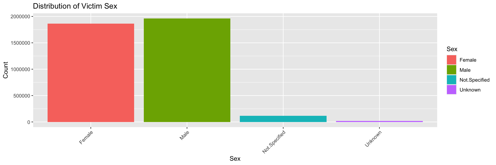

### Data & Libraries


::: {.cell}

```{.r .cell-code}
library(dplyr)
library(ggplot2)
library(readr)
library(tidyr)

data1 <- read.csv("Offender.csv")
data2 <- read.csv("Victim.csv")
data3 <- read.csv("Offender_ethnicity.csv")
data4 <- read.csv("Victim_ethnicity.csv")
data5 <- read.csv("Offender_race.csv")
data6 <- read.csv("Victim_race.csv")
data7 <- read.csv("Offender_sex.csv")
data8 <- read.csv("Victim_sex.csv")
data9 <- read.csv("Location.csv")
data10 <- read.csv("Relationship.csv")
data11 <- read.csv("Weapon.csv")
data12 <- read.csv("Offense.csv")

data7_long <- data7 %>%
  pivot_longer(
    cols = everything(),          
    names_to = "Sex",             
    values_to = "Count"           
  )

data8_long <- data8 %>%
  pivot_longer(
    cols = everything(),          
    names_to = "Sex",             
    values_to = "Count"           
  )
```
:::


# Visualizations of the Ages of Offenders and Victims

These charts reveal the age distribution of offenders and victims, highlighting whether certain age groups are more frequently involved.


::: {.cell}

```{.r .cell-code}
# Offender Age Distribution
ggplot(data1, aes(x = key, y = value, fill = value)) + 
  geom_bar(stat = "identity") +
  labs(title = "Offender Age Distribution", x = "Offender Age", y = "Count") +
  theme(axis.text.x = element_text(angle = 45, hjust = 1))
```

::: {.cell-output-display}
{width=1152}
:::

```{.r .cell-code}
# Victim Age Distribution
ggplot(data2, aes(x = key, y = value, fill = value)) + 
  geom_bar(stat = "identity") +
  labs(title = "Victim Age Distribution", x = "Victim Age", y = "Count") +
  theme(axis.text.x = element_text(angle = 45, hjust = 1))
```

::: {.cell-output-display}
{width=1152}
:::
:::

The offender age distribution highlights that the most common age bracket for offenders is 20–29, closely followed by the 30–39 age group. This suggests that individuals aged 20–39 are most frequently involved in offenses. Such findings could reflect societal, economic, or psychological factors influencing this demographic's behavior.

Similarly, the victim age distribution mirrors this trend, with the 20–29 age bracket being the most commonly affected group. This overlap may indicate that offenders and victims often belong to similar age groups, which could be linked to social environments or interpersonal relationships prevalent within these age ranges.

These observations are critical for designing targeted intervention strategies, such as community programs, outreach efforts, or educational campaigns, aimed at reducing offenses and protecting the most at-risk age groups.

# Visualizations of Ethnicity

The visualizations compare ethnicity and race distributions of offenders and victims, identifying potential correlations.


::: {.cell}

```{.r .cell-code}
# Offender Ethnicity Counts
ggplot(data3, aes(x = key, y = value, fill = value)) + 
  geom_bar(stat = "identity") +
  labs(title = "Offender Ethnicity Distribution", x = "Ethnicity", y = "Count") +
  theme(axis.text.x = element_text(angle = 45, hjust = 1))
```

::: {.cell-output-display}
{width=1152}
:::

```{.r .cell-code}
# Victim Ethnicity Counts
ggplot(data4, aes(x = key, y = value, fill = value)) + 
  geom_bar(stat = "identity") +
  labs(title = "Victim Ethnicity Distribution", x = "Ethnicity", y = "Count") +
  theme(axis.text.x = element_text(angle = 45, hjust = 1))
```

::: {.cell-output-display}
{width=1152}
:::
:::

From these distributions, we can infer important insights regarding ethnicity. Although the charts do not provide a detailed breakdown of specific ethnic groups, they reveal that the majority of both offenders and victims are identified as neither Hispanic nor Latino. This suggests that other ethnic groups may be more frequently involved as either offenders or victims.

This observation underscores the need for further analysis to understand the sociocultural and systemic factors contributing to these patterns. By identifying the specific ethnic groups represented and examining the contextual factors, policymakers and community leaders can design more effective interventions to address the root causes and disparities associated with crime and victimization.

# Visualizations of Race

These charts compare the distributions of races of the offenders and that of the victims.


::: {.cell}

```{.r .cell-code}
# Offender Race Counts
ggplot(data5, aes(x = key, y = value, fill = value)) + 
  geom_bar(stat = "identity") +
  labs(title = "Offender Race Distribution", x = "Race", y = "Count") +
  theme(axis.text.x = element_text(angle = 45, hjust = 1))
```

::: {.cell-output-display}
{width=1152}
:::

```{.r .cell-code}
# Victim Race Counts
ggplot(data6, aes(x = key, y = value, fill = value)) + 
  geom_bar(stat = "identity") +
  labs(title = "Victim Race Distribution", x = "Race", y = "Count") +
  theme(axis.text.x = element_text(angle = 45, hjust = 1))
```

::: {.cell-output-display}
{width=1152}
:::
:::


# Visualizations of Sex

These graphs examine the gender distribution, indicating whether males or females dominate certain roles in incidents.


::: {.cell}

```{.r .cell-code}
# Offender sex
ggplot(data7_long, aes(x = Sex, y = Count, fill = Sex)) +
  geom_bar(stat = "identity") +
  labs(title = "Distribution of Offender Sex", x = "Sex", y = "Count") +
  theme(axis.text.x = element_text(angle = 45, hjust = 1))
```

::: {.cell-output-display}
{width=1152}
:::

```{.r .cell-code}
# Victim sex
ggplot(data8_long, aes(x = Sex, y = Count, fill = Sex)) +
  geom_bar(stat = "identity") +
  labs(title = "Distribution of Victim Sex", x = "Sex", y = "Count") +
  theme(axis.text.x = element_text(angle = 45, hjust = 1))
```

::: {.cell-output-display}
{width=1152}
:::
:::


# Visualizations of Location


::: {.cell}

```{.r .cell-code}
# Location of Incidents
ggplot(data9, aes(x = key, y = value, fill = value)) +
  geom_bar(stat = "identity") +
  labs(title = "Incidents by Location", x = "Location", y = "Count") +
  theme(axis.text.x = element_text(angle = 45, hjust = 1))
```

::: {.cell-output-display}
{width=1152}
:::
:::


# Visualizations of Weapons used


::: {.cell}

```{.r .cell-code}
# Weapons used at Incident
ggplot(data11, aes(x = key, y = value, fill = value)) +
  geom_bar(stat = "identity") +
  labs(title = "Incidents by Weapon", x = "Weapon", y = "Count") +
  theme(axis.text.x = element_text(angle = 45, hjust =1))
```

::: {.cell-output-display}
{width=1152}
:::
:::


# Visualizations of Offense


::: {.cell}

```{.r .cell-code}
# Type of Offense
ggplot(data12, aes(x = key, y = value, fill = value)) +
  geom_bar(stat = "identity") +
  coord_flip() +
  labs(title = "Type of Offense", x= "Offense", y = "Count") +
  theme(axist.text.x = element_text(angle = 45, hjust =1))
```

::: {.cell-output-display}
{width=2112}
:::
:::


# Visualizations of Relationship between Offender and Victim

This chart investigates the relationships between offenders and victims, uncovering any recurring dynamics.


::: {.cell}

```{.r .cell-code}
# Relationship between Offender and Victim
ggplot(data10, aes(x = key, y = value, fill = value)) +
  geom_bar(stat = "identity") +
  coord_flip() +
  labs(title = "Relationship Between Offender and Victim", x = "Relationship", y = "Count")
```

::: {.cell-output-display}
{width=1152}
:::
:::
